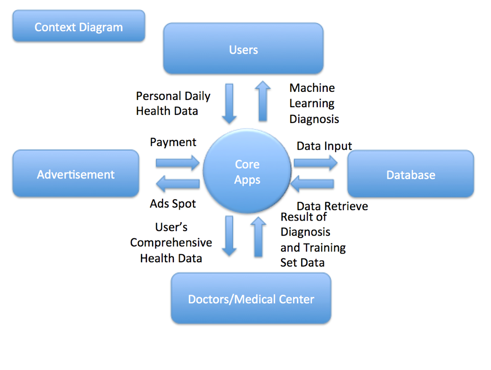
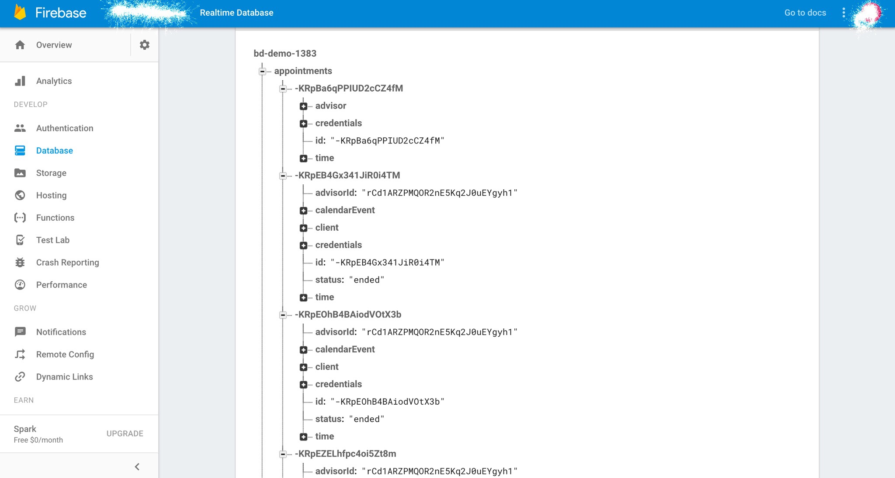

autoscale: true

## Let's have an app to track ADHD 
##### Presented by: Lucas Huang, Muthu Mohan, Yinghe Chen, Heng Yang

---

# What is ADHD? 
### Full Name: Attention Deficit Hyperactivity Disorder

—--

### Definition
##### A brain disorder marked by an ongoing pattern of inattention and/or hyperactivity-impulsivity that interferes with functioning or development*.

### Keywords:
##### Inattention, Hyperactivity, and Impulsivity

##### _*Source: National Institute of Mental Health_

---

# ADHD Symptoms:

Include but not limited to:
- Overlook or miss details
- Have problems sustaining attention in tasks or play
- Not seem to listen when spoken to directly 
- Be easily distracted by unrelated thoughts or stimuli 
- Fidget and squirm in their seats
- Be constantly in motion or “on the go,” or act as if “driven by a motor”
- Talk nonstop
- Interrupt or intrude on others
And more...

—--

# ADHD is very common in U.S.

—--

Among adults:
Lifetime Prevalence: 8.1% of U.S. adult population
12-month prevalence: 4.1% of U.S. adult population

---

Among children:
Lifetime Prevalence: 9.0% of 13 to 18 year olds
Lifetime Prevalence of “Severe” Disorder: 1.8% of 13 to 18 year olds

---

#### Data Collection Approaches:

## Case Study

---

## Why?

##### ADHD is an extremely well documented domain area 
##### Many medical and academic papers present
##### ADHD is a reclusive topic, so ethnography might be hard

---

### How did we do the Case Study?

##### We read close to 20-25 papers
##### Coding and doing memo
##### Browsing apps in App Store and Google Plays

—--

### Data Analysis:

##### ADHD is an early onset disorder that must be constantly monitored
##### Cannot be truly “cured” only managed
##### Takes doctors many months of trial and error to see what works
##### Hard to detect in younger ages
##### No proper tool exists for doctors to look at know if ADHD is a possibility.
##### ADHD must be identified early

—--

### Use Case Diagram:
- Login/Sign-Up
- Behavior Logging: allows patients to log how they behave and helpers to log how the people they are helping behave on a daily basis.
- View Tracking progress: user could review behaviors tracked during certain period of time.
- Access User Data: Doctors have access to user data.
- Provide diagnosis: Based on the user data, doctors could provide diagnosis to the user.
- Retrieve Notification and Diagnosis: The app will notify patient when feedback and diagnosis are available. User could view the diagnosis directly from the app.

—--

# What does the app do?

- Signup and Login are two separate buttons, showing at the same screen.
- The Signup page contains preferred username, preferred password, age, gender, user type (patient or helper).
- Data are only available to patients and helpers in app.
- The data is presented in graphic chart.
- The raw data can be exported to files in PDF, Excel or CSV format.
- A graphical interface should be designed for doctors specifically, which allow doctors to manage patients profiles, view logs, and input diagnosis.
- In-app notification should display number of unread diagnosis.
- User/Doctor should be able to opt in/out of email notification.

---

# Origins of Requirements

- Most of the requirements come from the context diagram(Generated by data analysis), and we have to have these requirements to ensure a functionable structure.
- Sign-Up/Login ensured the connection between users and database, the graphical interface designed for doctor ensured the connection between doctors and database, and the in-app notification system ensured the communication between users and doctors.
- We used idea of ontology to divide our users into patients, helpers, and doctors.
- A mobile app should be frequent-use so that our app required patient input daily.

---

# Architecture Models

^
- it is quite helpful to translate our ideas into something we can engineer
- we chose these two because they are most suitable
- we won't jump into details

---

^
key: focus on how data flows

---

^
key: focus on functions work with each other

---

---

^
- enought!
- going to talk abuot GUI: my faviourite
- we don't have the expertise to use PS etc
- but we have tools

Let see something tangible!

---

# Optional User System:

^ 
- first launch
- reason why sign-up is not mandatory(we are not like facebook)
- mention show/hide pwd
- how to assocaite data?

- Landing page for first launch
- Sign-up is not mandatory
- Users can sign up later from the Setting page
- Standards functionalities like editing profile page and resetting passwords

—--

How can I associate user data then?

---

# Landing:

^
- features intro
- straightforward to what we available and more importantly what we are not

- Presentation main feature with a quadrant layout:
	- Rater - Behavior Tracking Module
     	- Data Presentation
     	- Data Exportation
     	- Settings

---

^ 
- not okay: slider menu
- no other ideas
- focused, emphasize what is available and not

Why quadrant layout?

—--

# Rater:

^
- it is a UI from RobinHood, a stock app
- clear and no extra UIs

- Step by step questionnaires
- Go to the next by answering the current question
- Easily go back to the last question
- No extra UI

---

^ 
- is it a bug? No
- prevent accidentally click to exit the flow
- we do not actually want users to exit

Why don’t we have an exit button? :scream:

—--

^ how about move the cancel button to the bottom and make it red

What are some improvements you can think of?

---

# Data Presentation:

^
- summary at the top
- showing data at the bottom
- edit, delete

- Top section: a line chart or other types of chart for presenting data in a graphical manner
- Bottom section: All recorded data entries from Rater

---

^ go to next one for the answer

What’s some NFR you can think of here?

—--

^
iOS has a great mechanism to handle it
but for web, we need to think abuot that

What if there are thousands of data entries?

---

# Date Exportation:

^ 
- we are not expertise in UI/UX
- Probably we do not want to share to Facebook and Twitter
- stay on presetation screen with transparent background

- Can share in PDF, Excel, or CSV formats
- Emails is only required item here

---

^
- better demonstarte this feature is available

Why the exportation shows in the main page?

—--

# Settings:

^ 
- standard setting screen
- we do not want to overdo after all users won't spend long time here
- we want the flow to be comfortable and smooth

- Turn Push/Local Notification on/off
- Navigate to the User System
- Some other information like About, Contact, Privacy etc.

—--

^
- notification
- potential feature: input data in the watch

—--

# Software Interface: Firebase

^ 
- will talk about it. think of it as a database for now
- TestFlight, Apple Developer Portal
- Server dashboard and so on

---

---

# *Lessons* We Learned

—--

# *Biases* have a severe impact on what path the theory takes, first we leaned towards a task management app then switched to our current idea

No concrete idea until the app ADHD MedTest was found (https://itunes.apple.com/us/app/adhd-medtest/id1092899357?mt=8)

—--

### We tried our best to follow the *software engineering process*, but it didn’t always fall according to the outline due to changes in requirements, the idea of twin peaks was definitely realized.

---

## *Reverse engineering* is a great way to formulate a new product and isolate the flaws of the existing product!

---

# Similarities with Class Material

- Glossary of Terms was very helpful for us to focus our requirements and architecture models
- By diagramming the use case and context diagrams we were able to identify who our major actors and users were, allowing us to craft functional requirements for them
- There are lots of non-functional requirements that we need to solve as well. The mobile environment(Android 4.4 above, and iOS 10 & 11), hybrid mobile development Vs. native apps. This directly had an impact on what architecture we were going to use
- The idea of how architecture and requirements co-evolve was predominate throughout our project. Even design was influenced by our arch. choices.

---

# Let's talk about Tools

^
hi, it is me again

##### :smirk:

---

^ 
- Firebase is a mobile and web application development platform. Firebase is made up of complementary features that developers can mix-and-match to fit their needs. 
- real time 
- data storage
- data analytics
- crash reporting
- authentication
- back by Google: reliable
- good for startup
- various SDKs available

- how did we create this presentation

### [Adobe Comp](https://helpx.adobe.com/mobile-apps/how-to/layout-ideas-go.html)

### [Firebase](https://firebase.google.com/)

### [Draw.io](https://www.draw.io/)

### [GitHub](https://github.com/Lucashuang0802/COEN278-2017-Winter-Presentation)

### [Deckset](https://www.decksetapp.com/)

---

# Thank you y'all!

--- 

One last thing!

---

